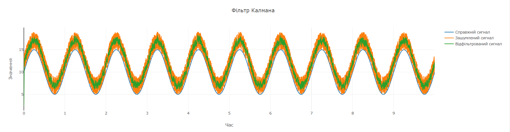

<h3>Дослідження фільтра Калмана</h3>

<b>1. Ініціалізація коду</b> 
Використано базовий шаблон фільтра Калмана. Встановлені початкові параметри, такі як матриця процесу (F), матриця вимірювань (H), коваріація процесу (Q), коваріація вимірювань (R), початкова оцінка невизначеності (P) і початковий стан (x). 

<b>2. Дослідження впливу параметрів</b> 
1. Матриця коваріації шуму процесу (Q): 

При збільшенні значення Q(10) фільтр буде більше довіряти моделі, а не вимірюванням, що може призвести до більш інерційного фільтра, який менш чутливо реагує на шум.
 

При зменшенні Q(0.1) фільтр стане чутливішим до змін у вимірюваннях, що може збільшити коливання.
 

2. Матриця коваріації шуму вимірювання (R): 

При збільшенні значення R(20) фільтр більше покладається на модель процесу, ігноруючи шумні вимірювання. Відфільтрований сигнал став плавнішим, але із запізненням.
 

При зменшенні значення R(1) фільтр став більше довіряти вимірюванням, що призвело до меншого згладжування, але збільшило коливання в результатах.
 

3. Початкова матриця коваріації (P): 

При збільшенні значення P(10) фільтр менше впевнений у початковому стані, що призводить до швидшого реагування на вимірювання.
 

При зменшенні значення P(0.1) фільтр більш впевнений у початковій оцінці стану, що знижує швидкість його адаптації до нових даних.
 

4. Початкова оцінка стану (x): 

При збільшенні значення x(10) початкова оцінка стану ближча до реальної, тому фільтр швидше збігається, забезпечуючи точніше передбачення з меншими коливаннями. Система швидко адаптується до змін у реальних даних і коригує свій стан.
 

Зменшення значення x(0) призводить до того, що початкова оцінка стану далека від реальної, і фільтру потрібно більше часу для збіжності. Процес корекції затягується, а фільтр може виявляти більшу нестабільність перед тим, як налаштуватися на точне передбачення.
 
      
5. Постійна складова сигналу (offset): 

Збільшення зсуву (20) призводить до того, що фільтр адаптується повільніше, особливо коли початковий стан суттєво відрізняється від реального. Відбувається затримка у корекції стану, і результати фільтра можуть бути менш точними на початкових етапах.
 

Зменшення зсуву (5) робить сигнал ближчим до початкових значень, що дозволяє фільтру працювати точніше та швидше адаптуватися до змін у сигналі.
 

  
6. Загальний час моделювання (total_time): 

Збільшення загального часу моделювання (10) дає фільтру більше можливостей для адаптації, що може призвести до покращення точності передбачень і стабільнішої роботи з часом.
 

Зменшення загального часу моделювання (0.5) обмежує час, необхідний для повної адаптації фільтра, особливо якщо параметри системи мають високу інерційність, що може призвести до менш точних результатів.
  

